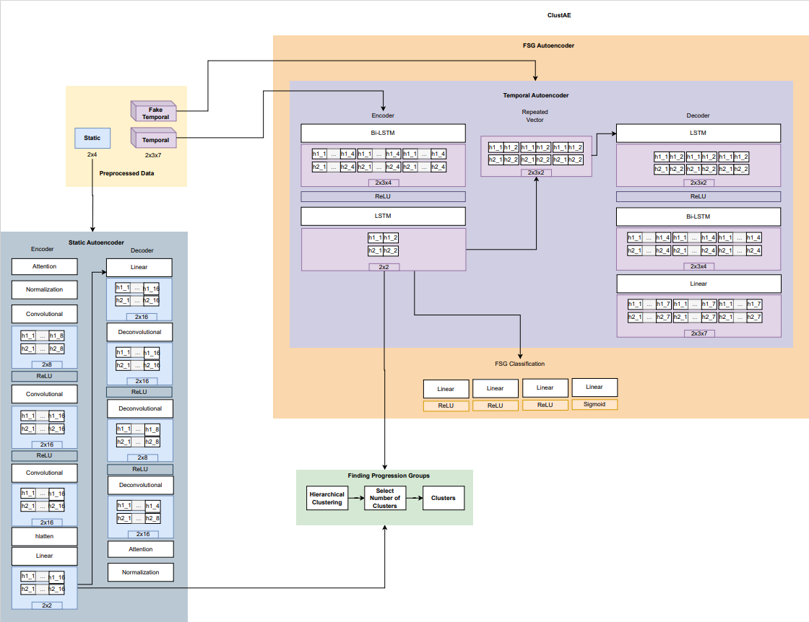

# ClustAE

Identifying disease progression patterns and groups of similar progressors is becoming relevant to the understanding of disease behaviours and to improving personalized treatments. Amyotrophic Lateral Sclerosis (ALS) is a neurodegenerative disease with patients manifesting heterogeneous temporal progressions. We propose a novel approach, ClustAE, to learn representations of the features in a lower dimensional space and use these representations to obtain groups of patients with similar progressions. This is achieved from an agglomerative clustering process.





<!---
### Run ClustAE:

```
python3 .\src\clustric.py <config_file>)
```

#### Config File

```
DATA_FILE: <path_to_snapshots_file>
TOP_FOLDER: <output_folder_name>
N_CLUST: <number_of_clusters>  
MIN_APP: <minimal_number_of_appointments>             
REF_FEATURE: <feature_to_identify_each_patient>

TEMPORAL_FEATURES: <list_temporal_features>
```

### Relevant Citations
Full article can be found here: <insert article link>)
-->