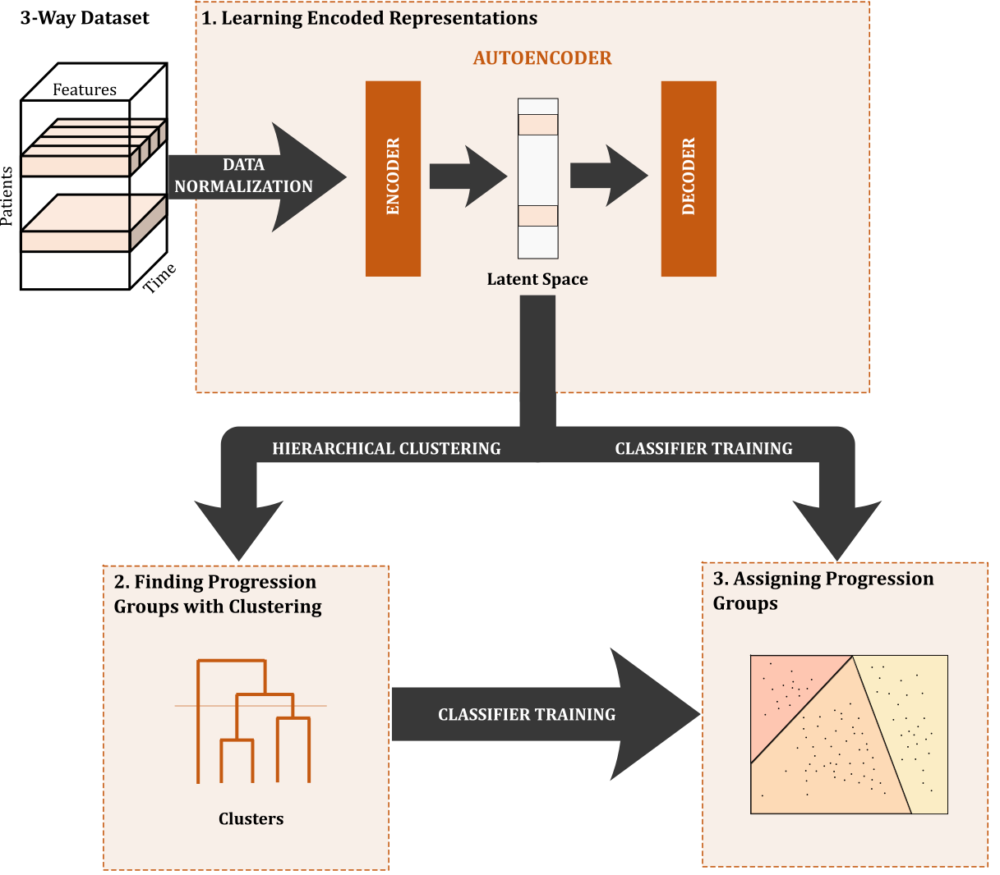

# ClustAE

Patient stratification enhances the understanding of disease heterogeneity and can support clinicians to tailor interventions to individual patients. In this work, we propose ClustAE, a deep learning-based stratification method. ClustAE processes longitudinal and static data to extract patterns using an autoencoder architecture. These patterns are subsequently clustered to find the different subgroups of patients. As case study, we applied ClustAE to heterogeneous longitudinal data from patients with Amyotrophic Lateral Sclerosis (ALS). This approach successfully identified four groups of patients each showing distinct progressions and characteristics. The results showed that, in general, these groups improved prognostic predictions when used to train group-specific predictors, demonstrating ClustAE's potential in improving patient-specific outcome predictions.





<!---
### Run ClustAE:

```
python3 .\src\clustric.py <config_file>)
```

#### Config File

```
DATA_FILE: <path_to_snapshots_file>
TOP_FOLDER: <output_folder_name>
N_CLUST: <number_of_clusters>  
MIN_APP: <minimal_number_of_appointments>             
REF_FEATURE: <feature_to_identify_each_patient>

TEMPORAL_FEATURES: <list_temporal_features>
```

### Relevant Citations
Full article can be found here: <insert article link>)
-->